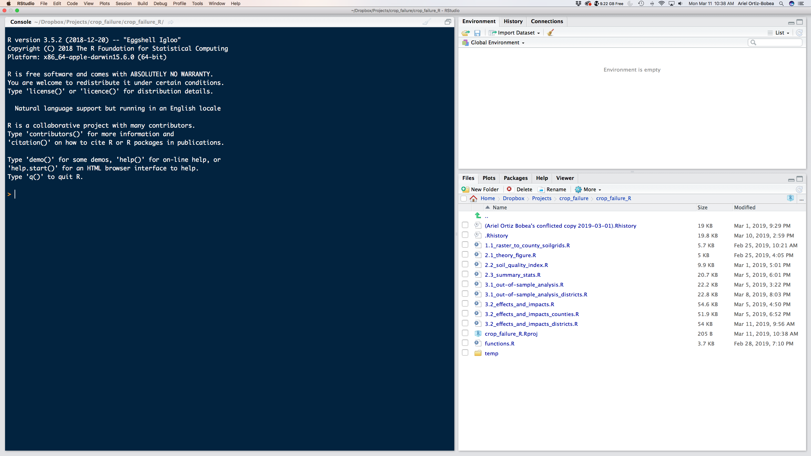

```{r setup, include=FALSE}
knitr::opts_chunk$set(echo = TRUE)
```

# Plan for today

1. Presentations and syllabus
2. Motivation
3. Installation
4. The R world
5. Getting your hands dirty with R

------------------------------------------------------------------------

# Motivation

-   What is R?
-   What is RStudio?
-   Why R?
-   R versus other software

------------------------------------------------------------------------

# Installation

-   Install R: <https://www.r-project.org>
-   Install RStudio: <https://www.rstudio.com>

------------------------------------------------------------------------

# The R world

-   Objects

    -   Everything in R is an object

-   Packages

    -   Packages provide new functionalities
    -   R comes pre-equipped with various base packages
    -   You can load packages to obtain new superpowers
    -   You must install packages before loading them

-   Functions

    -   You feed in inputs into the argument(s) and it spits output
    -   Functions are the main reason you get a package
    -   But you can (and should) create your own

------------------------------------------------------------------------

# Getting your hands dirty with R

```{r, out.width = "700px", echo=F}

```
