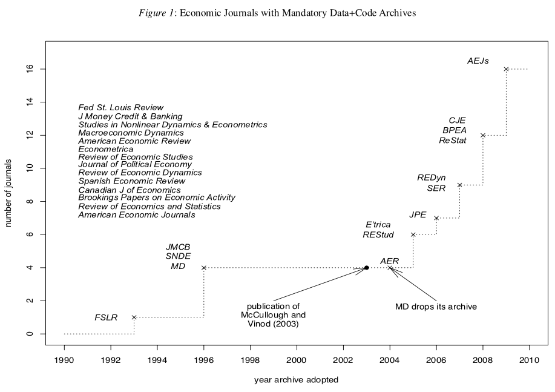

```{r setup, include=FALSE}
knitr::opts_chunk$set(echo = TRUE)
```

# Plan for today

1. Motivation 
2. Reproducibility versus replicability
3. Multiple approaches


-----

# Motivation

- Whether you like it or not, you'll soon have to post your code & data for others to reproduce your analysis
- Figure from [McCullough (2009)](https://www.sciencedirect.com/science/article/pii/S0313592609500471)


```{r, out.width = "600px", echo=F}

```


----

# The importance of reproducibility

_"Replication is the cornerstone of science. Research that cannot be replicated is not science, and cannot be trusted either as part of the profession’s accumulated body of knowledge or as a basis for policy. Authors may think they have written perfect code for their bug-free software package and correctly transcribed each data point, but readers cannot safely assume that these error-prone activities have been executed flawlessly until the authors’ efforts have been independently verified. A researcher who does not openly allow independent verification of his results puts those results in the same class as the results of a researcher who does share his data and code but whose results cannot be replicated: the class of results that cannot be verified, i.e., the class of results that cannot be trusted."_

From [McCullough, B. D., & Vinod, H. D. (2003)](https://pubs.aeaweb.org/doi/pdf/10.1257/000282803322157133)  

----

# Reproducibility versus replicability

- Many people use these terms interchangeably. But these are different concepts.
- Excerpts from Lars Vilhuber's paper for the National Academies on the subject (https://www.nap.edu/resource/25303/Reproducibility%20in%20Economics.pdf)
- Reproducibility refers to _“to the ability [...] to duplicate the results of a prior study using the same materials and procedures as were used by the original investigator.”_ 
- Replicability refers to _“the ability of a researcher to duplicate the results of a prior study if the same procedures are followed but new data are collected”_

---

# Multiple approaches to reproducible R programming
1. the newbie error-prone approach
2. approach we have been using so far
3. installing local repositories
4. pacman + remotes
5. renv
6. checkpoint
7. Docker


----

